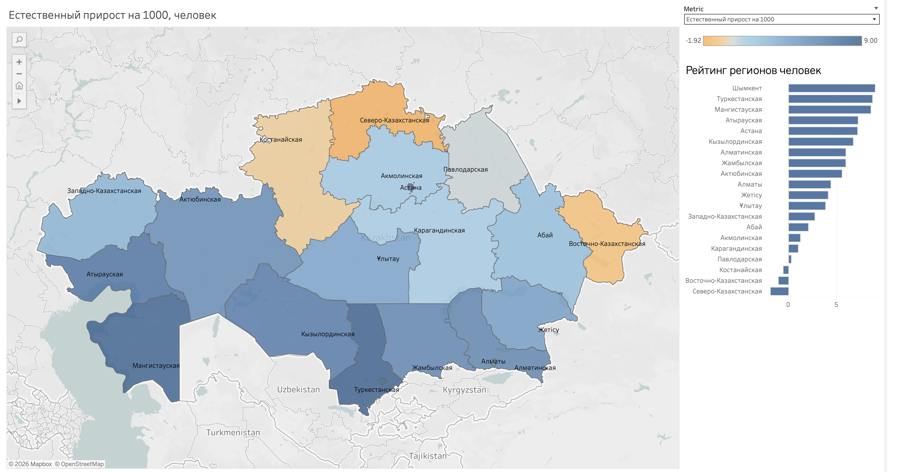
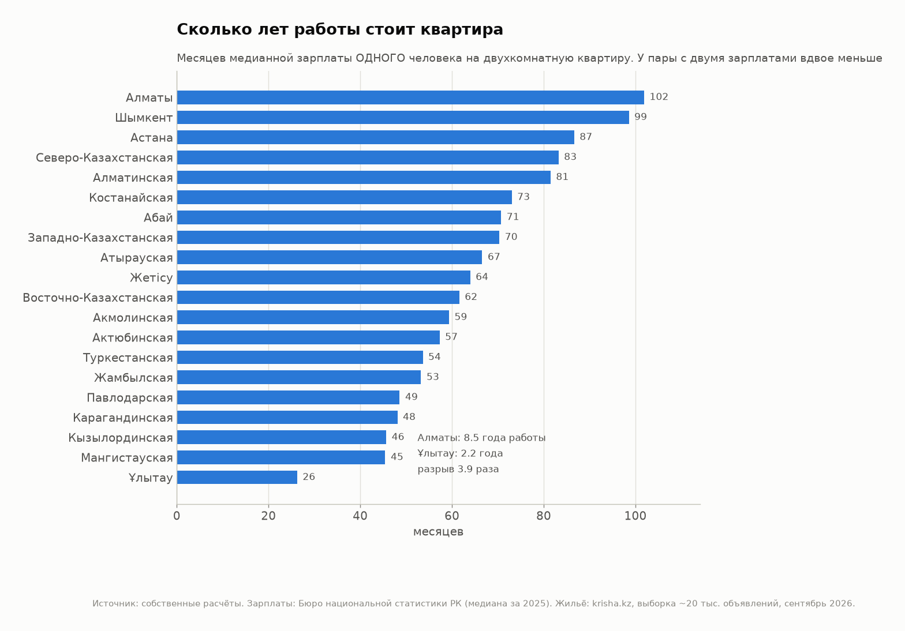
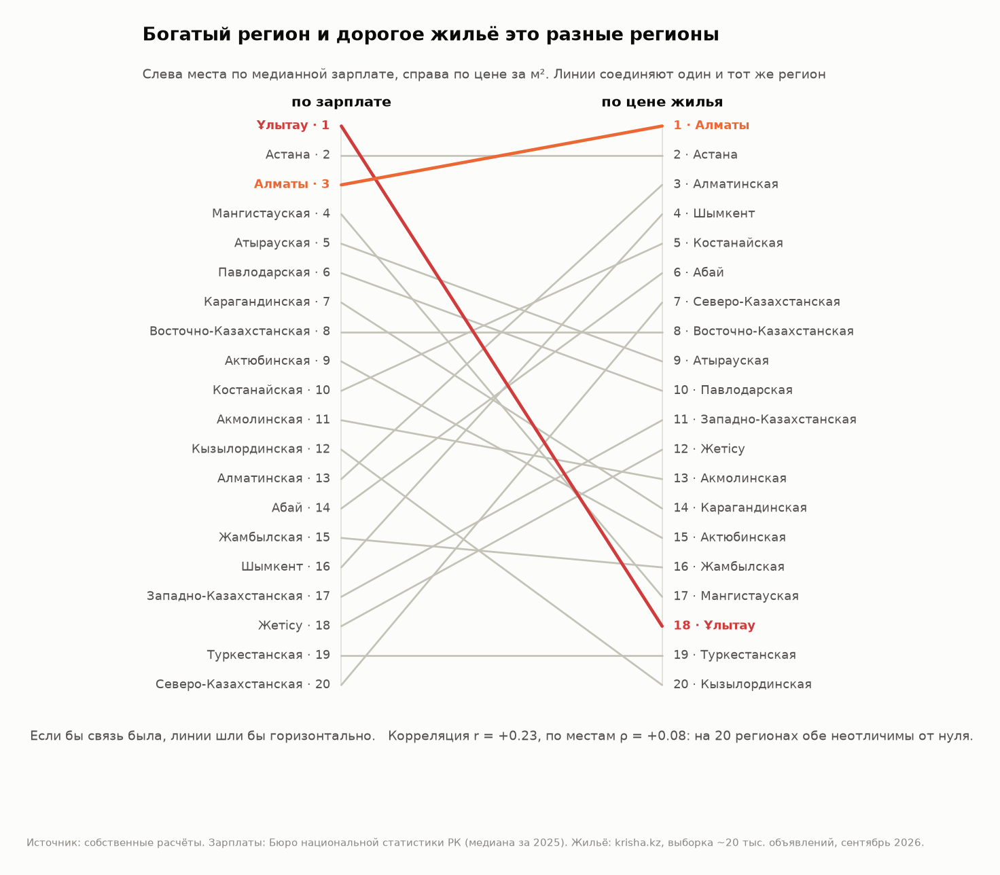
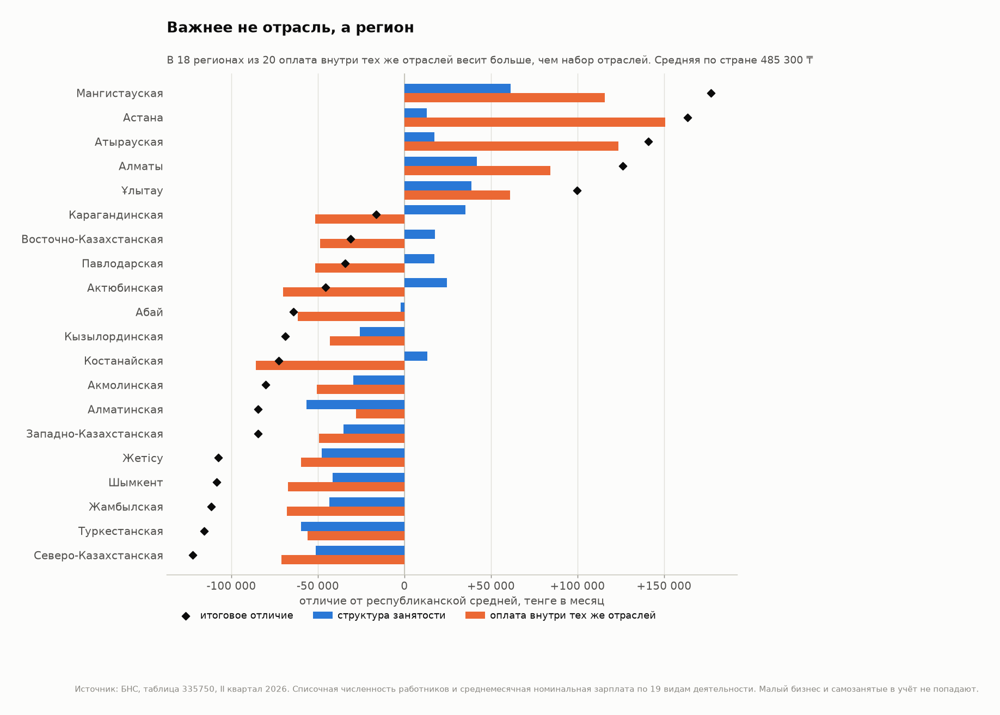
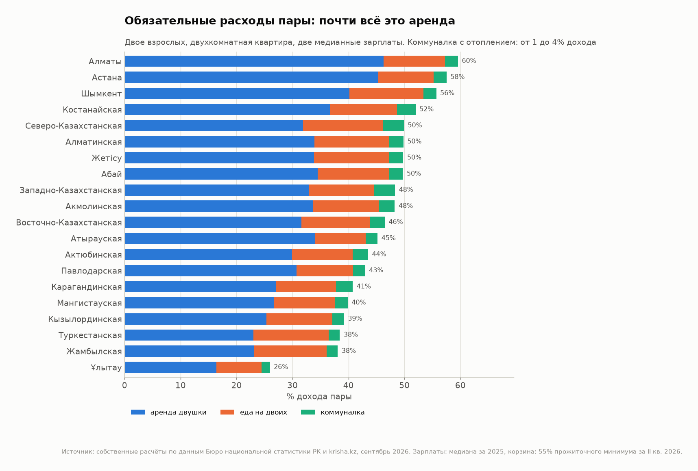
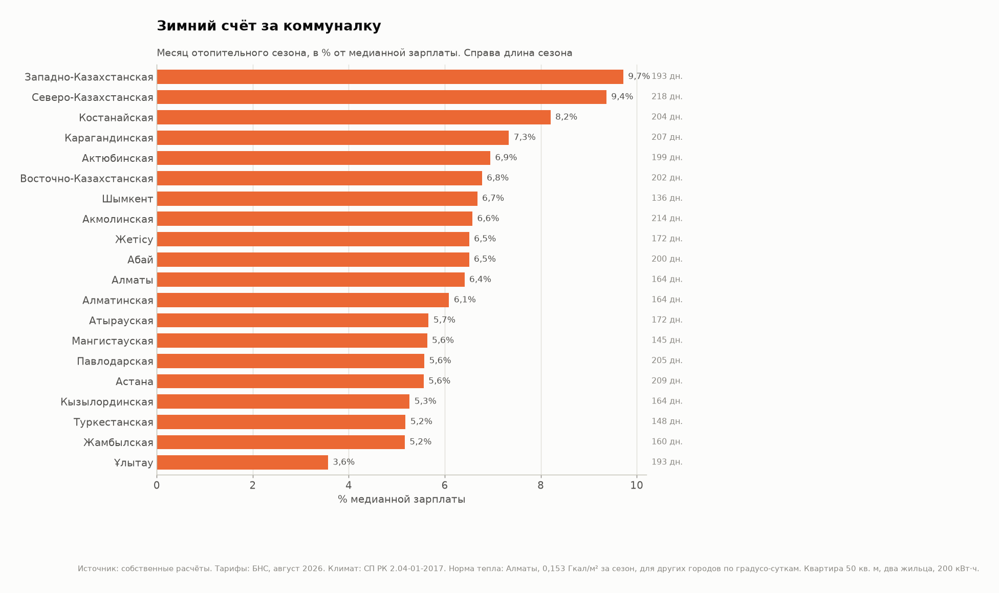
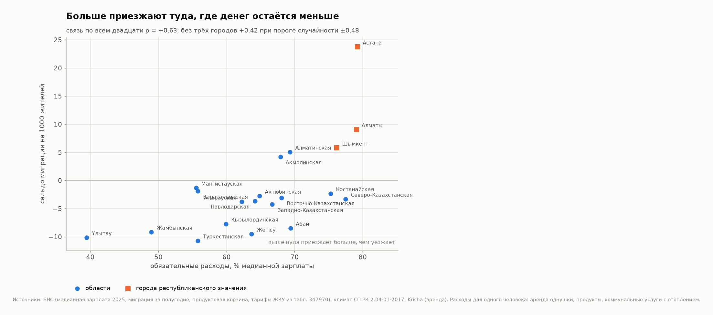

# Сколько лет работы стоит квартира: 20 регионов Казахстана в цифрах

Моё первое исследование как аналитика данных. Я сравнил все 20 регионов Казахстана по одному приземлённому вопросу: **сколько остаётся от зарплаты после того, что платить обязательно**, то есть после аренды, еды и коммуналки. А потом проверил, едут ли люди туда, где остаётся больше.

Полный текст статьи: [article/article.md](article/article.md)
Интерактивный дашборд: [Tableau Public](https://public.tableau.com/shared/J4FP82BN9)



## Главное

1. **Двухкомнатная квартира стоит от 26 до 102 месяцев медианной зарплаты.** Дешевле всего в Ұлытау, дороже всего в Алматы. Разрыв 3,9 раза, а сами зарплаты между регионами различаются всего в 1,8 раза.
2. **Где платят больше, там не обязательно дороже жить.** Корреляция между медианной зарплатой и ценой метра +0,23, для 20 регионов это шум.
3. **Важнее регион, чем отрасль.** В 18 регионах из 20 отличие от средней зарплаты по стране больше объясняется оплатой в тех же отраслях, чем набором отраслей.
4. **Главная статья обязательных расходов это аренда**: от 65% до 82% всех обязательных трат. Еда и коммуналка стоят почти одинаково по стране, но зимний счёт за коммуналку забирает от 3,6% до 9,7% медианной зарплаты.
5. **Больше всего людей переезжает туда, где жить дороже всего**: в Астану, Алматы и Шымкент. Без этих трёх городов связь между расходами и переездами пропадает.

## Ключевые графики

### Сколько месяцев зарплаты стоит квартира


### Богатый регион и дорогое жильё это разные регионы


### Отрасль или регион


### Из чего складываются обязательные расходы


### Зимний счёт за коммуналку


### Куда едут люди


## Данные

| Что | Откуда | Период |
|---|---|---|
| Зарплаты по регионам | Бюро национальной статистики (БНС), медиана и средняя | 2025 год |
| Зарплаты по отраслям | БНС | II квартал 2026 |
| Жильё | krisha.kz, собственный парсер: 19 983 объявления о продаже и 12 198 об аренде | 15 сентября 2026 |
| Население и миграция | БНС | январь–июнь 2026 |
| Продукты | БНС: прожиточный минимум, розничные цены, бюджеты домохозяйств | II квартал и август 2026 |
| Коммуналка | БНС: тарифы; климат: СП РК 2.04-01-2017 | август 2026 |

Все цифры с Krisha сверены с официальной статистикой БНС: порядок регионов по цене жилья совпадает с ранговой корреляцией 0,89. Где и почему есть расхождения, разобрано в Главе 8 статьи.

## Как собирались объявления с Krisha

В репозитории лежит парсер Krisha, остальные скрипты проекта (разбор таблиц БНС, расчёты, графики) я не выкладывал.

- `src/parse_krisha.py` разбирает одну страницу выдачи и карточки объявлений.
- `src/crawl_krisha.py` обходит регион по полосам площади и считает веса.
- `src/regions.py` справочник 20 регионов: названия, коды, слаги Krisha.

Что в них интересного:

- **Выдача нарезана на полосы по площади.** Krisha отдаёт не больше тысячи объявлений на запрос, поэтому рынок каждого региона делится на полосы (до 25 м², 25–30, 30–35 и так далее), из каждой берётся понемногу, а медиана считается с весами: сколько таких объявлений на рынке, делённое на сколько таких в выборке.
- **Krisha добивает страницу чужими объявлениями.** Если по запросу нашлось два объявления, на странице всё равно будет 20–25 карточек из других регионов. Единственный надёжный список найденного лежит в JSON внутри страницы, в блоке `jsdata`.
- **Три фильтра**: рекламные карточки жилых комплексов, посуточная аренда и объявления без цены выбрасываются.

### Запуск

```bash
pip install -r requirements.txt

# одна страница, ничего не сохраняет
python3 src/parse_krisha.py --dry-run --region sko --deal sale --rooms 2

# посчитать план обхода региона, ничего не скачивая
python3 src/crawl_krisha.py --regions sko --deal sale --plan-only

# полный обход
python3 src/crawl_krisha.py --regions sko --deal both
```

Коды регионов: `python3 src/regions.py`.

## Стек

Python (pandas, requests, BeautifulSoup, matplotlib), Tableau Public.

## Автор

Никита Булава, Петропавловск. Если заметили ошибку в расчётах, пишите в issues.
